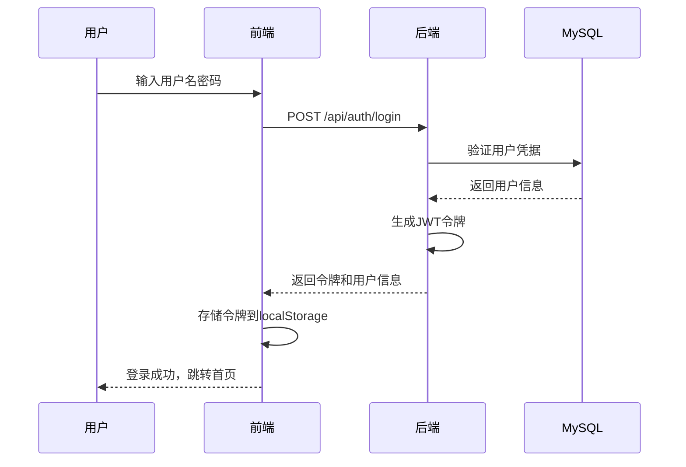
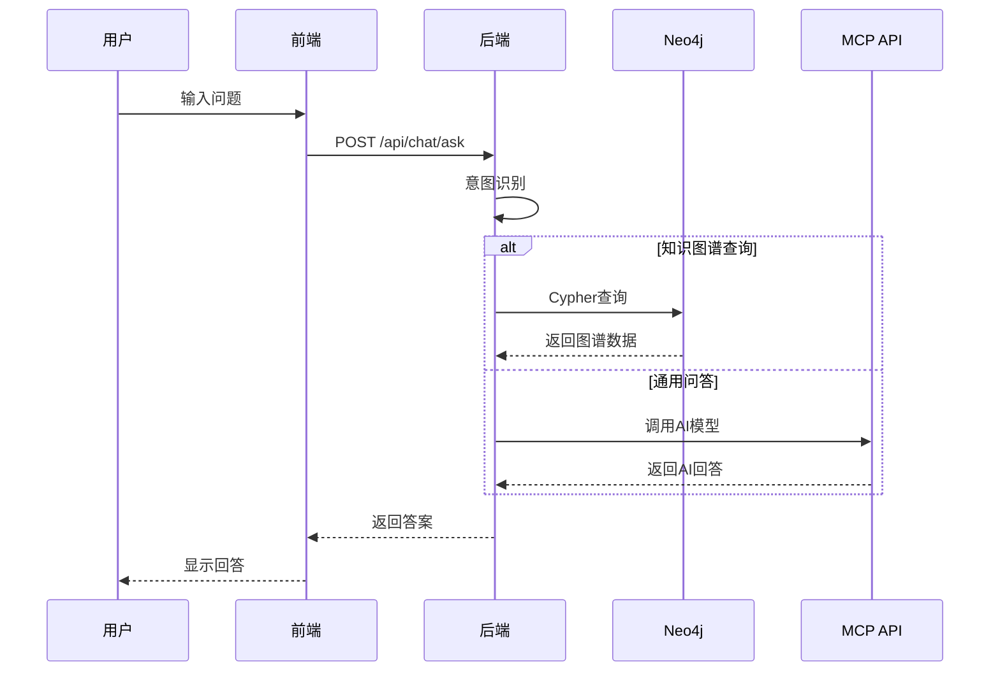

# 文物大数据与人工智能集成系统 - 开发者指南

> 一份完整的技术架构总结和API参考文档，帮助开发者快速理解项目结构并进行开发维护。

## 📋 目录

1. [项目概述](#1-项目概述)
2. [技术架构详解](#2-技术架构详解)
3. [项目结构分析](#3-项目结构分析)
4. [核心功能实现](#4-核心功能实现)
5. [数据库设计](#5-数据库设计)
6. [API接口文档](#6-api接口文档)
7. [部署运维指南](#7-部署运维指南)
8. [开发环境配置](#8-开发环境配置)
9. [常见问题及解决方案](#9-常见问题及解决方案)
10. [扩展开发指导](#10-扩展开发指导)

---

## 1. 项目概述

### 1.1 项目定位
本系统是一个文物数据管理和智能分析平台，集成了大数据分析、知识图谱和人工智能技术。主要为文博机构、研究人员及文物爱好者提供文物数据的存储、检索、分析和智能问答服务。

> **📌 功能状态**：项目**功能基本完整**，所有核心功能均已实现，仅个人信息编辑功能尚未开发。

### 1.2 功能状态说明

#### ✅ 已实现功能
- **用户认证系统** - JWT身份验证、用户登录注册、权限管理
- **文物搜索功能** - 全文搜索、多维筛选、分页展示
- **数据可视化** - ECharts图表、统计分析大屏、响应式设计

#### ⚠️ 待实现功能
- **个人信息编辑** - 用户资料修改和更新功能
- **知识图谱** - Neo4j存储、Cytoscape.js可视化、关系探索
- **智能问答系统** - MCP API集成、意图识别、对话历史管理
- **词云分析** - 中文分词、词频统计、可视化展示
- **系统诊断** - 数据库连接监控、服务状态检查
- **个人信息查看** - 用户资料展示、登录历史

### 1.2 系统特点
- **前后端分离架构**：React + Node.js
- **多数据库支持**：MySQL（结构化数据）+ Neo4j（知识图谱）+ Redis（缓存）
- **AI集成**：MCP大模型API智能问答
- **容器化部署**：Docker Compose一键部署
- **完整的用户体系**：JWT认证 + 角色权限管理

---

## 2. 技术架构详解

### 2.1 整体架构图

```
                    ┌─────────────────┐
                    │   Nginx Proxy   │
                    └─────────┬───────┘
                              │
                    ┌─────────▼───────┐
                    │   React Frontend │
                    │   (Port 8080)    │
                    └─────────┬───────┘
                              │ HTTP API
                    ┌─────────▼───────┐
                    │ Node.js Backend  │
                    │  (Port 13000)    │
                    └─────┬───┬───┬───┘
                          │   │   │
              ┌───────────┘   │   └─────────────┐
              │               │                 │
    ┌─────────▼───┐  ┌───────▼───┐    ┌───────▼───┐
    │   MySQL     │  │   Neo4j   │    │   Redis   │
    │ (Port 3306) │  │(Port 7474)│    │(Port 6379)│
    └─────────────┘  └───────────┘    └───────────┘
                              │
                    ┌─────────▼───────┐
                    │  MCP AI Service │
                    │   (External)    │
                    └─────────────────┘
```

### 2.2 技术栈详情

#### 🎨 前端技术栈
```json
{
  "框架": "React 18.2.0",
  "路由": "React Router 6.11.1",
  "UI组件": "Ant Design 5.4.6",
  "数据可视化": "ECharts 5.4.2 + ECharts-WordCloud 2.1.0",
  "图谱可视化": "Cytoscape.js 3.23.0",
  "HTTP客户端": "Axios 1.4.0",
  "JWT解析": "jwt-decode 3.1.2"
}
```

#### 🔧 后端技术栈
```json
{
  "运行时": "Node.js",
  "Web框架": "Express 4.18.2",
  "身份认证": "jsonwebtoken 9.0.0 + bcrypt 5.1.0",
  "数据库驱动": {
    "MySQL": "mysql2 3.2.4",
    "Neo4j": "neo4j-driver 5.7.0",
    "Redis": "redis 4.6.6"
  },
  "中文分词": "nodejieba 2.5.2",
  "API文档": "swagger-ui-express 4.6.3",
  "安全防护": "helmet 6.1.5 + express-rate-limit 6.7.0",
  "HTTP客户端": "axios 1.4.0"
}
```

#### 💾 数据存储架构
- **MySQL 8.0**：存储用户信息、文物基础数据、操作日志
- **Neo4j 5.x**：存储文物知识图谱、实体关系
- **Redis 7.x**：用户会话、API缓存、临时数据

### 2.3 核心业务流程

#### 用户认证流程


#### 智能问答流程


---

## 3. 项目结构分析

### 3.1 目录结构总览
```
artifact-data-dashboard/
├── backend/                     # 后端服务（Node.js/Express）
│   ├── src/
│   │   ├── index.js            # 应用入口文件
│   │   ├── config/
│   │   │   └── database.js     # 数据库连接配置
│   │   ├── middleware/
│   │   │   ├── auth.middleware.js    # JWT认证中间件
│   │   │   └── error.middleware.js   # 错误处理中间件
│   │   ├── routes/             # API路由定义
│   │   │   ├── auth.routes.js        # 用户认证路由
│   │   │   ├── artifact.routes.js    # 文物管理路由
│   │   │   ├── stats.routes.js       # 统计分析路由
│   │   │   ├── graph.routes.js       # 知识图谱路由
│   │   │   ├── wordcloud.routes.js   # 词云分析路由
│   │   │   └── chat.routes.js        # 智能问答路由
│   │   └── services/
│   │       └── mcp.service.js        # MCP AI服务封装
│   ├── scripts/                # 数据库初始化脚本
│   │   ├── init-mysql.sql      # MySQL表结构和示例数据
│   │   ├── init-neo4j.js       # Neo4j图谱初始化
│   │   └── sample-data.js      # 示例数据生成
│   ├── package.json            # 后端依赖配置
│   └── Dockerfile              # 后端容器构建文件
├── frontend/                   # 前端应用（React）
│   ├── src/
│   │   ├── App.js             # 主应用组件
│   │   ├── pages/             # 页面组件
│   │   │   ├── Login.js             # 登录页面
│   │   │   ├── Register.js          # 注册页面
│   │   │   ├── Dashboard.js         # 数据大屏
│   │   │   ├── Search.js            # 文物搜索
│   │   │   ├── KnowledgeGraph.js    # 知识图谱
│   │   │   ├── Chat.js              # 智能问答
│   │   │   ├── Wordcloud.js         # 词云分析
│   │   │   ├── Profile.js           # 用户资料
│   │   │   └── Debug.js             # 系统诊断
│   │   └── services/          # API服务层
│   │       ├── auth.service.js      # 认证服务
│   │       ├── artifact.service.js  # 文物服务
│   │       ├── stats.service.js     # 统计服务
│   │       ├── graph.service.js     # 图谱服务
│   │       ├── chat.service.js      # 问答服务
│   │       └── wordcloud.service.js # 词云服务
│   ├── package.json           # 前端依赖配置
│   └── Dockerfile.dev         # 前端开发容器配置
├── doc/                       # 项目文档
│   ├── readme.md             # 原始项目说明
│   ├── api-doc.md            # API接口文档
│   ├── demo.html             # 功能演示页面
│   └── developer-guide.md    # 本开发者指南
├── docker-compose.yml        # 开发环境容器编排
├── docker-compose.prod.yml   # 生产环境容器编排
└── README.md                 # 项目主说明文档
```

### 3.2 关键文件说明

#### backend/src/index.js - 应用入口
```javascript
// 主要功能：
// 1. Express应用初始化和中间件配置
// 2. 路由注册和API文档配置
// 3. 错误处理和启动监听
// 4. Swagger API文档服务
```

#### backend/src/config/database.js - 数据库配置
```javascript
// 主要功能：
// 1. MySQL连接池配置（支持utf8mb4字符集）
// 2. Neo4j驱动初始化（带连接池管理）
// 3. Redis客户端连接
// 4. 数据库健康检查方法
```

#### frontend/src/App.js - 前端主组件
```javascript
// 主要功能：
// 1. React Router路由配置
// 2. Ant Design布局组件
// 3. 用户认证状态管理
// 4. 侧边栏导航和权限控制
```

---

## 4. 核心功能实现

### 4.1 用户认证系统

#### 认证机制
- **JWT Token认证**：无状态令牌，存储在localStorage
- **bcrypt密码加密**：使用10轮盐值哈希
- **角色权限控制**：admin/user两级权限

#### 关键实现文件
```javascript
// backend/src/middleware/auth.middleware.js
const authMiddleware = (req, res, next) => {
  const token = req.header('Authorization')?.replace('Bearer ', '');
  // JWT验证逻辑
  const decoded = jwt.verify(token, process.env.JWT_SECRET);
  req.user = decoded;
  next();
};

// frontend/src/services/auth.service.js
const login = async (credentials) => {
  const response = await axios.post('/api/auth/login', credentials);
  localStorage.setItem('token', response.data.token);
  return response.data;
};
```

### 4.2 文物搜索系统

#### 搜索功能
- **全文搜索**：基于MySQL FULLTEXT索引
- **多维筛选**：按类别、年代、地点筛选
- **分页展示**：支持自定义页大小

#### 数据库索引配置
```sql
-- MySQL全文索引配置
ALTER TABLE artifacts ADD FULLTEXT INDEX idx_artifact_fulltext (name, description, tags);
```

### 4.3 知识图谱系统

#### 图谱结构
```cypher
// Neo4j节点类型
(:Artifact)   - 文物实体
(:Era)        - 历史朝代  
(:Location)   - 地理位置
(:Category)   - 文物类别
(:Material)   - 制作材质

// 关系类型
(:Artifact)-[:BELONGS_TO]->(:Era)
(:Artifact)-[:DISCOVERED_IN]->(:Location)
(:Artifact)-[:CATEGORIZED_AS]->(:Category)
(:Artifact)-[:MADE_OF]->(:Material)
```

#### 可视化实现
```javascript
// frontend/src/pages/KnowledgeGraph.js
// 使用Cytoscape.js进行图谱可视化
const cytoscape = {
  elements: {
    nodes: graphData.nodes.map(node => ({
      data: { id: node.id, label: node.label, type: node.type }
    })),
    edges: graphData.edges.map(edge => ({
      data: { source: edge.source, target: edge.target, label: edge.label }
    }))
  },
  style: cytoscapeStyles,
  layout: { name: 'cose' }
};
```

### 4.4 智能问答系统

#### 意图识别机制
```javascript
// backend/src/services/mcp.service.js
const identifyIntent = (question) => {
  const knowledgeGraphKeywords = ['什么时候', '哪里出土', '属于什么', '年代'];
  return knowledgeGraphKeywords.some(keyword => 
    question.includes(keyword)) ? 'knowledge_graph' : 'general_chat';
};
```

#### 降级处理策略
当MCP API不可用时，系统自动使用预设回答：
```javascript
const simulateResponse = (question) => {
  const responses = {
    '四羊方尊': '四羊方尊是商代晚期的青铜礼器...',
    '默认': '抱歉，AI服务暂时不可用，请稍后重试。'
  };
  return responses[question] || responses['默认'];
};
```

### 4.5 数据可视化系统

#### ECharts图表配置
```javascript
// frontend/src/pages/Dashboard.js
const chartOptions = {
  categoryChart: {
    type: 'bar',
    data: {
      labels: stats.categoryStats.map(item => item.category),
      datasets: [{
        data: stats.categoryStats.map(item => item.count),
        backgroundColor: ['#1890ff', '#52c41a', '#faad14', '#f5222d']
      }]
    }
  }
};
```

### 4.6 词云分析系统

#### 中文分词处理
```javascript
// backend/src/routes/wordcloud.routes.js
const nodejieba = require('nodejieba');

router.get('/generate', async (req, res) => {
  const texts = await getArtifactDescriptions();
  const words = nodejieba.extract(texts.join(' '), 100);
  const wordFreq = words.map(word => ({ name: word.word, value: word.weight }));
  res.json({ success: true, data: wordFreq });
});
```

---

## 5. 数据库设计

### 5.1 MySQL数据结构

#### 用户表(users)
```sql
CREATE TABLE users (
  id INT AUTO_INCREMENT PRIMARY KEY,
  username VARCHAR(50) NOT NULL UNIQUE,
  email VARCHAR(100) NOT NULL UNIQUE,
  password_hash VARCHAR(255) NOT NULL,      -- bcrypt哈希
  role ENUM('admin', 'user') DEFAULT 'user',
  created_at TIMESTAMP DEFAULT CURRENT_TIMESTAMP,
  updated_at TIMESTAMP DEFAULT CURRENT_TIMESTAMP ON UPDATE CURRENT_TIMESTAMP
);
```

#### 文物表(artifacts)
```sql
CREATE TABLE artifacts (
  id INT AUTO_INCREMENT PRIMARY KEY,
  name VARCHAR(255) NOT NULL,
  description TEXT,
  category VARCHAR(50),                     -- 青铜器、陶瓷、玉器等
  era VARCHAR(50),                         -- 商代、西周、唐代等
  location VARCHAR(100),                   -- 出土地点
  image_url VARCHAR(255),
  tags TEXT,                              -- 标签，逗号分隔
  is_cataloged BOOLEAN DEFAULT FALSE,      -- 是否已编目
  is_digitized BOOLEAN DEFAULT FALSE,      -- 是否已数字化
  needs_repair BOOLEAN DEFAULT FALSE,      -- 是否需要修复
  created_at TIMESTAMP DEFAULT CURRENT_TIMESTAMP,
  updated_at TIMESTAMP DEFAULT CURRENT_TIMESTAMP ON UPDATE CURRENT_TIMESTAMP,
  FULLTEXT INDEX idx_artifact_fulltext (name, description, tags)
);
```

#### 操作日志表(logs)
```sql
CREATE TABLE logs (
  id INT AUTO_INCREMENT PRIMARY KEY,
  user_id INT NOT NULL,
  action VARCHAR(50) NOT NULL,            -- login, search, view等
  target_id INT,                          -- 操作对象ID
  timestamp TIMESTAMP DEFAULT CURRENT_TIMESTAMP,
  details TEXT,                           -- 操作详情JSON
  FOREIGN KEY (user_id) REFERENCES users(id) ON DELETE CASCADE
);
```

### 5.2 Neo4j图谱结构

#### 节点创建示例
```cypher
// 创建文物节点
CREATE (a:Artifact {
  id: '1',
  name: '四羊方尊',
  description: '商代晚期青铜礼器',
  era: '商代',
  location: '湖南宁乡'
});

// 创建朝代节点
CREATE (e:Era {id: 'shang', name: '商代', period: '约公元前1600年-约公元前1046年'});

// 创建关系
MATCH (a:Artifact {id: '1'}), (e:Era {id: 'shang'})
CREATE (a)-[:BELONGS_TO]->(e);
```

#### 常用查询模式
```cypher
// 查找特定文物的所有关系
MATCH (a:Artifact {name: '四羊方尊'})-[r]-(n)
RETURN a, r, n;

// 查找同一朝代的文物
MATCH (a1:Artifact)-[:BELONGS_TO]->(e:Era)<-[:BELONGS_TO]-(a2:Artifact)
WHERE a1.name = '四羊方尊' AND a1 <> a2
RETURN a2;
```

---

## 6. API接口文档

### 6.1 接口规范

#### 基本信息
- **基础URL**: `http://localhost:13000/api`
- **认证方式**: `Authorization: Bearer <JWT-Token>`
- **数据格式**: JSON
- **字符编码**: UTF-8

#### 通用响应格式
```json
// 成功响应
{
  "success": true,
  "data": {},
  "message": "操作成功"
}

// 错误响应
{
  "success": false,
  "error": {
    "message": "错误描述",
    "details": "详细错误信息"
  },
  "timestamp": "2025-05-30T10:00:00.000Z"
}
```

### 6.2 认证接口

#### POST /auth/register - 用户注册
```javascript
// 请求体
{
  "username": "newuser",
  "email": "user@example.com",
  "password": "password123"
}

// 响应（200）
{
  "success": true,
  "message": "注册成功",
  "user": {
    "id": 1,
    "username": "newuser",
    "email": "user@example.com",
    "role": "user"
  }
}
```

#### POST /auth/login - 用户登录
```javascript
// 请求体
{
  "email": "user@example.com",
  "password": "password123"
}

// 响应（200）
{
  "success": true,
  "token": "eyJhbGciOiJIUzI1NiIs...",
  "user": {
    "id": 1,
    "username": "newuser",
    "email": "user@example.com",
    "role": "user"
  }
}
```

#### GET /auth/profile - 获取用户资料
```javascript
// 请求头
Authorization: Bearer <token>

// 响应（200）
{
  "success": true,
  "data": {
    "id": 1,
    "username": "newuser",
    "email": "user@example.com",
    "role": "user",
    "created_at": "2025-05-30T08:00:00.000Z"
  }
}
```

### 6.3 文物管理接口

#### GET /artifacts - 获取文物列表
```javascript
// 查询参数
?page=1&limit=10&search=青铜&category=青铜器&era=商代

// 响应（200）
{
  "success": true,
  "data": {
    "artifacts": [
      {
        "id": 1,
        "name": "四羊方尊",
        "description": "商代晚期青铜礼器...",
        "category": "青铜器",
        "era": "商代",
        "location": "湖南宁乡",
        "image_url": "https://example.com/image.jpg",
        "tags": "青铜,方尊,礼器",
        "is_cataloged": true,
        "is_digitized": true,
        "needs_repair": false,
        "created_at": "2025-05-30T08:00:00.000Z",
        "updated_at": "2025-05-30T08:00:00.000Z"
      }
    ],
    "pagination": {
      "total": 100,
      "page": 1,
      "limit": 10,
      "totalPages": 10
    }
  }
}
```

#### GET /artifacts/:id - 获取文物详情
```javascript
// 路径参数：id=1

// 响应（200）
{
  "success": true,
  "data": {
    "id": 1,
    "name": "四羊方尊",
    "description": "商代晚期青铜礼器，出土于湖南宁乡...",
    "category": "青铜器",
    "era": "商代",
    "location": "湖南宁乡",
    "image_url": "https://example.com/image.jpg",
    "tags": "青铜,方尊,礼器,兽面纹",
    "is_cataloged": true,
    "is_digitized": true,
    "needs_repair": false,
    "created_at": "2025-05-30T08:00:00.000Z",
    "updated_at": "2025-05-30T08:00:00.000Z"
  }
}
```

### 6.4 统计分析接口

#### GET /stats/overview - 获取统计概览
```javascript
// 响应（200）
{
  "success": true,
  "data": {
    "total": 1500,
    "catalogedCount": 1200,
    "digitizedCount": 800,
    "needsRepairCount": 50,
    "categoryStats": [
      {"category": "青铜器", "count": 450},
      {"category": "陶瓷", "count": 350},
      {"category": "玉器", "count": 200}
    ],
    "locationStats": [
      {"location": "河南", "count": 300},
      {"location": "陕西", "count": 250}
    ],
    "eraStats": [
      {"era": "商代", "count": 200},
      {"era": "西周", "count": 180}
    ]
  }
}
```

#### GET /stats/test-connection - 测试数据库连接
```javascript
// 响应（200）
{
  "success": true,
  "data": {
    "connection": "success",
    "mysql": "connected",
    "neo4j": "connected",
    "redis": "connected"
  }
}
```

### 6.5 知识图谱接口

#### GET /graph - 获取图谱数据
```javascript
// 查询参数
?query=四羊方尊&limit=50

// 响应（200）
{
  "success": true,
  "data": {
    "nodes": [
      {
        "id": "artifact_1",
        "label": "四羊方尊",
        "type": "Artifact",
        "properties": {
          "name": "四羊方尊",
          "era": "商代",
          "category": "青铜器"
        }
      },
      {
        "id": "era_shang",
        "label": "商代",
        "type": "Era",
        "properties": {
          "name": "商代",
          "period": "约公元前1600年-约公元前1046年"
        }
      }
    ],
    "edges": [
      {
        "id": "rel_1",
        "source": "artifact_1",
        "target": "era_shang",
        "label": "BELONGS_TO"
      }
    ]
  }
}
```

#### GET /graph/entity/:id - 获取实体详情
```javascript
// 路径参数：id=artifact_1

// 响应（200）
{
  "success": true,
  "data": {
    "id": "artifact_1",
    "label": "四羊方尊",
    "type": "Artifact",
    "properties": {
      "name": "四羊方尊",
      "description": "商代晚期青铜礼器...",
      "era": "商代",
      "location": "湖南宁乡"
    },
    "relationships": [
      {
        "type": "BELONGS_TO",
        "target": {
          "id": "era_shang",
          "label": "商代",
          "type": "Era"
        }
      }
    ]
  }
}
```

### 6.6 智能问答接口

#### POST /chat/ask - 发送问题
```javascript
// 请求体
{
  "question": "四羊方尊是什么年代的文物？",
  "conversationId": "conv_123" // 可选
}

// 响应（200）
{
  "success": true,
  "data": {
    "answer": "四羊方尊是商代晚期的青铜礼器，约公元前13-11世纪。",
    "conversationId": "conv_123",
    "source": "knowledge_graph", // 或 "mcp_model", "simulation"
    "intent": "artifact_info",
    "graphData": { // 当source为knowledge_graph时包含
      "nodes": [...],
      "edges": [...]
    }
  }
}
```

#### GET /chat/history - 获取对话历史
```javascript
// 查询参数（可选）
?conversationId=conv_123

// 响应（200）- 指定会话
{
  "success": true,
  "data": {
    "conversationId": "conv_123",
    "messages": [
      {
        "role": "user",
        "content": "四羊方尊是什么年代的文物？",
        "timestamp": "2025-05-30T10:00:00.000Z"
      },
      {
        "role": "assistant",
        "content": "四羊方尊是商代晚期的青铜礼器...",
        "timestamp": "2025-05-30T10:00:01.000Z"
      }
    ]
  }
}

// 响应（200）- 所有会话列表
{
  "success": true,
  "data": [
    {
      "conversationId": "conv_123",
      "createdAt": "2025-05-30T10:00:00.000Z",
      "messagesCount": 4,
      "lastMessage": "四羊方尊是商代晚期的青铜礼器..."
    }
  ]
}
```

### 6.7 词云分析接口

#### GET /wordcloud/generate - 生成词云数据
```javascript
// 查询参数（可选）
?category=青铜器&limit=100

// 响应（200）
{
  "success": true,
  "data": [
    {"name": "青铜", "value": 85},
    {"name": "礼器", "value": 72},
    {"name": "商代", "value": 68},
    {"name": "方尊", "value": 45},
    {"name": "出土", "value": 38}
  ]
}
```

### 6.8 错误代码说明

| HTTP状态码 | 错误类型 | 说明 |
|-----------|----------|------|
| 400 | Bad Request | 请求参数错误或格式不正确 |
| 401 | Unauthorized | 未提供认证令牌或令牌无效 |
| 403 | Forbidden | 权限不足，无法访问资源 |
| 404 | Not Found | 请求的资源不存在 |
| 429 | Too Many Requests | 请求频率超限（每15分钟100次） |
| 500 | Internal Server Error | 服务器内部错误 |
| 503 | Service Unavailable | 外部服务（如MCP API）不可用 |

---

## 7. 部署运维指南

### 7.1 Docker容器部署

#### 环境要求
- Docker 20.10+
- Docker Compose 2.0+
- 可用内存: 4GB+（推荐8GB）
- 可用磁盘: 20GB+

#### 一键部署流程
```bash
# 1. 克隆项目
git clone https://github.com/yourusername/artifact-data-dashboard.git
cd artifact-data-dashboard

# 2. 配置环境变量
cp backend/.env.example backend/.env
# 编辑.env文件，配置数据库密码和MCP API密钥

# 3. 启动所有服务
docker-compose up -d

# 4. 查看服务状态
docker-compose ps

# 5. 查看日志
docker-compose logs -f backend
```

#### 生产环境部署
```bash
# 使用生产环境配置
docker-compose -f docker-compose.prod.yml up -d

# 生产环境特点：
# - 使用Nginx反向代理
# - 优化的容器资源配置
# - 数据持久化卷挂载
# - 健康检查配置
```

### 7.2 服务端口配置

| 服务 | 端口 | 说明 |
|------|------|------|
| 前端应用 | 8080 | React开发服务器 |
| 后端API | 13000 | Node.js/Express服务 |
| MySQL | 3306 | 数据库服务（内部） |
| Neo4j | 7474/7687 | 图数据库HTTP/Bolt协议 |
| Redis | 6379 | 缓存服务（内部） |

### 7.3 数据持久化

#### 数据卷配置
```yaml
# docker-compose.yml
volumes:
  mysql_data:
    driver: local
  neo4j_data:
    driver: local
  redis_data:
    driver: local
  
services:
  mysql:
    volumes:
      - mysql_data:/var/lib/mysql
  neo4j:
    volumes:
      - neo4j_data:/data
  redis:
    volumes:
      - redis_data:/data
```

#### 备份策略
```bash
# MySQL数据备份
docker exec artifact-dashboard-mysql mysqldump -u root -p artifact_db > backup.sql

# Neo4j数据备份
docker exec artifact-dashboard-neo4j neo4j-admin dump --database=neo4j --to=/tmp/backup.dump

# Redis数据备份
docker exec artifact-dashboard-redis redis-cli BGSAVE
```

### 7.4 监控与日志

#### 应用日志查看
```bash
# 查看所有服务日志
docker-compose logs -f

# 查看特定服务日志
docker-compose logs -f backend
docker-compose logs -f frontend

# 查看最近100行日志
docker-compose logs --tail=100 backend
```

#### 性能监控
```bash
# 查看容器资源使用情况
docker stats

# 查看服务健康状态
docker-compose ps
```

---

## 8. 开发环境配置

### 8.1 本地开发环境

#### 环境要求
- Node.js 16.0+
- npm 8.0+ 或 yarn 1.22+
- Git 2.30+

#### 后端开发配置
```bash
# 进入后端目录
cd backend

# 安装依赖
npm install

# 配置环境变量
cp .env.example .env
# 编辑.env文件，配置数据库连接信息

# 启动开发服务器（支持热重载）
npm run dev

# 运行测试
npm test
```

#### 前端开发配置
```bash
# 进入前端目录
cd frontend

# 安装依赖
npm install

# 启动开发服务器
npm start

# 构建生产版本
npm run build

# 运行测试
npm test
```

### 8.2 环境变量配置

#### backend/.env示例
```bash
# 服务配置
PORT=3000
NODE_ENV=development

# 数据库配置
MYSQL_HOST=localhost
MYSQL_PORT=3306
MYSQL_USER=root
MYSQL_PASSWORD=your_password
MYSQL_DATABASE=artifact_db

# Neo4j配置
NEO4J_URI=bolt://localhost:7687
NEO4J_USER=neo4j
NEO4J_PASSWORD=your_password

# Redis配置
REDIS_HOST=localhost
REDIS_PORT=6379
REDIS_PASSWORD=

# JWT配置
JWT_SECRET=your_jwt_secret_key_here
JWT_EXPIRES_IN=24h

# MCP AI API配置
AI_API_ENDPOINT=https://api.mcp.example.com/v1/chat/completions
AI_API_KEY=your_mcp_api_key_here
```

### 8.3 IDE配置建议

#### VS Code配置
```json
// .vscode/settings.json
{
  "editor.codeActionsOnSave": {
    "source.fixAll.eslint": true
  },
  "editor.formatOnSave": true,
  "editor.defaultFormatter": "esbenp.prettier-vscode"
}

// .vscode/extensions.json
{
  "recommendations": [
    "esbenp.prettier-vscode",
    "dbaeumer.vscode-eslint",
    "ms-vscode.vscode-typescript-next",
    "bradlc.vscode-tailwindcss"
  ]
}
```

#### 代码规范配置
```json
// .eslintrc.js
module.exports = {
  extends: ['react-app', 'react-app/jest'],
  rules: {
    'no-console': 'warn',
    'prefer-const': 'error',
    'no-unused-vars': 'warn'
  }
};

// .prettierrc
{
  "semi": true,
  "trailingComma": "es5",
  "singleQuote": true,
  "printWidth": 80,
  "tabWidth": 2
}
```

---

## 9. 常见问题及解决方案

### 9.1 部署相关问题

#### Q: Docker容器启动失败
```bash
# 检查容器状态
docker-compose ps

# 查看错误日志
docker-compose logs [service_name]

# 常见解决方法：
# 1. 检查端口是否被占用
netstat -tulpn | grep :8080

# 2. 清理Docker缓存
docker system prune -a

# 3. 重新构建镜像
docker-compose build --no-cache
```

#### Q: 数据库连接失败
```bash
# 检查数据库服务状态
docker-compose exec mysql mysql -u root -p -e "SELECT 1"

# 检查Neo4j连接
docker-compose exec neo4j cypher-shell -u neo4j -p password "RETURN 'connected'"

# 解决方法：
# 1. 确认.env文件配置正确
# 2. 等待数据库完全启动（通常需要30-60秒）
# 3. 检查防火墙设置
```

#### Q: 前端无法连接后端API
```bash
# 检查后端服务是否运行
curl http://localhost:13000/api/stats/test-connection

# 检查前端代理配置
# frontend/package.json中的proxy配置是否正确
"proxy": "http://backend:3000"

# 解决方法：
# 1. 确认后端服务正常运行
# 2. 检查CORS配置
# 3. 验证网络连通性
```

### 9.2 功能相关问题

#### Q: MCP AI服务无响应
系统会自动降级到模拟回答模式：
```javascript
// 检查AI服务配置
console.log(process.env.AI_API_ENDPOINT);
console.log(process.env.AI_API_KEY);

// 手动测试API连接
curl -H "Authorization: Bearer YOUR_API_KEY" \
     -H "Content-Type: application/json" \
     -d '{"messages":[{"role":"user","content":"test"}]}' \
     YOUR_API_ENDPOINT
```

#### Q: 知识图谱显示异常
```javascript
// 检查Neo4j数据
docker-compose exec neo4j cypher-shell -u neo4j -p password \
  "MATCH (n) RETURN count(n) as node_count"

// 重新初始化图谱数据
docker-compose exec backend node /app/scripts/init-neo4j.js
```

#### Q: 词云分析没有数据
```bash
# 检查中文分词模块
docker-compose exec backend node -e "
const jieba = require('nodejieba');
console.log(jieba.cut('这是一个测试文本'));
"

# 确认文物数据包含中文描述
docker-compose exec mysql mysql -u root -p artifact_db \
  -e "SELECT COUNT(*) FROM artifacts WHERE description IS NOT NULL"
```

### 9.3 性能优化建议

#### 数据库优化
```sql
-- MySQL索引优化
ANALYZE TABLE artifacts;
OPTIMIZE TABLE artifacts;

-- 查看慢查询
SHOW VARIABLES LIKE 'slow_query_log';
SHOW VARIABLES LIKE 'long_query_time';
```

#### Neo4j性能调优
```cypher
// 创建索引以提高查询性能
CREATE INDEX artifact_name IF NOT EXISTS FOR (a:Artifact) ON (a.name);
CREATE INDEX era_name IF NOT EXISTS FOR (e:Era) ON (e.name);

// 查看查询计划
EXPLAIN MATCH (a:Artifact)-[:BELONGS_TO]->(e:Era) RETURN a, e;
```

#### 缓存策略
```javascript
// Redis缓存配置
const redis = require('redis');
const client = redis.createClient({
  url: 'redis://localhost:6379',
  socket: {
    reconnectStrategy: (retries) => Math.min(retries * 50, 500)
  }
});

// 缓存文物搜索结果
const cacheKey = `search:${query}:${page}:${limit}`;
const cachedResult = await client.get(cacheKey);
if (cachedResult) {
  return JSON.parse(cachedResult);
}
```

---

## 10. 扩展开发指导

### 10.1 添加新的API接口

#### 步骤1：创建路由文件
```javascript
// backend/src/routes/new-feature.routes.js
const express = require('express');
const router = express.Router();

/**
 * @swagger
 * /api/new-feature:
 *   get:
 *     summary: 新功能接口
 *     description: 详细描述新功能
 *     responses:
 *       200:
 *         description: 成功响应
 */
router.get('/', async (req, res) => {
  try {
    // 业务逻辑实现
    const result = await newFeatureService();
    res.json({ success: true, data: result });
  } catch (error) {
    res.status(500).json({ 
      success: false, 
      error: { message: error.message } 
    });
  }
});

module.exports = router;
```

#### 步骤2：注册路由
```javascript
// backend/src/index.js
const newFeatureRoutes = require('./routes/new-feature.routes');

// 注册新路由
app.use('/api/new-feature', authMiddleware, newFeatureRoutes);
```

#### 步骤3：创建前端服务
```javascript
// frontend/src/services/new-feature.service.js
import axios from 'axios';

const API_BASE = '/api/new-feature';

export const getNewFeatureData = async () => {
  const response = await axios.get(API_BASE);
  return response.data;
};
```

### 10.2 添加新的页面组件

#### 步骤1：创建页面组件
```javascript
// frontend/src/pages/NewFeature.js
import React, { useState, useEffect } from 'react';
import { Card, Spin, Alert } from 'antd';
import { getNewFeatureData } from '../services/new-feature.service';

const NewFeature = () => {
  const [loading, setLoading] = useState(true);
  const [data, setData] = useState(null);
  const [error, setError] = useState(null);

  useEffect(() => {
    const fetchData = async () => {
      try {
        const result = await getNewFeatureData();
        setData(result.data);
      } catch (err) {
        setError(err.message);
      } finally {
        setLoading(false);
      }
    };

    fetchData();
  }, []);

  if (loading) return <Spin size="large" />;
  if (error) return <Alert type="error" message={error} />;

  return (
    <Card title="新功能页面">
      {/* 页面内容 */}
    </Card>
  );
};

export default NewFeature;
```

#### 步骤2：添加路由
```javascript
// frontend/src/App.js
import NewFeature from './pages/NewFeature';

// 在路由配置中添加
<Route path="/new-feature" element={<NewFeature />} />
```

#### 步骤3：添加导航菜单
```javascript
// frontend/src/App.js
const menuItems = [
  // ...existing items
  {
    key: '/new-feature',
    icon: <YourIcon />,
    label: '新功能'
  }
];
```

### 10.3 扩展数据库结构

#### MySQL表扩展
```sql
-- 添加新的表
CREATE TABLE new_entity (
  id INT AUTO_INCREMENT PRIMARY KEY,
  name VARCHAR(255) NOT NULL,
  description TEXT,
  artifact_id INT,
  created_at TIMESTAMP DEFAULT CURRENT_TIMESTAMP,
  FOREIGN KEY (artifact_id) REFERENCES artifacts(id) ON DELETE CASCADE,
  INDEX idx_name (name),
  INDEX idx_artifact_id (artifact_id)
);

-- 为现有表添加字段
ALTER TABLE artifacts 
ADD COLUMN new_field VARCHAR(100) AFTER location,
ADD INDEX idx_new_field (new_field);
```

#### Neo4j图谱扩展
```cypher
// 添加新的节点类型
CREATE (n:NewNodeType {
  id: 'unique_id',
  name: 'Node Name',
  properties: 'value'
});

// 创建新的关系类型
MATCH (a:Artifact), (n:NewNodeType)
WHERE a.id = '1' AND n.id = 'unique_id'
CREATE (a)-[:NEW_RELATIONSHIP]->(n);

// 创建约束以确保数据一致性
CREATE CONSTRAINT new_node_id IF NOT EXISTS 
FOR (n:NewNodeType) REQUIRE n.id IS UNIQUE;
```

### 10.4 集成新的AI服务

#### 服务抽象层
```javascript
// backend/src/services/ai-service-factory.js
class AIServiceFactory {
  static createService(type) {
    switch (type) {
      case 'mcp':
        return new MCPService();
      case 'openai':
        return new OpenAIService();
      case 'custom':
        return new CustomAIService();
      default:
        throw new Error(`Unsupported AI service type: ${type}`);
    }
  }
}

// 统一的AI服务接口
class BaseAIService {
  async ask(question, context = {}) {
    throw new Error('Method not implemented');
  }
  
  async identifyIntent(question) {
    throw new Error('Method not implemented');
  }
}
```

#### 配置切换
```javascript
// backend/src/config/ai-config.js
const aiConfig = {
  default: process.env.AI_SERVICE_TYPE || 'mcp',
  services: {
    mcp: {
      endpoint: process.env.MCP_API_ENDPOINT,
      apiKey: process.env.MCP_API_KEY
    },
    openai: {
      endpoint: 'https://api.openai.com/v1/chat/completions',
      apiKey: process.env.OPENAI_API_KEY
    }
  }
};
```

### 10.5 代码质量保证

#### 单元测试示例
```javascript
// backend/tests/auth.test.js
const request = require('supertest');
const app = require('../src/index');

describe('Authentication', () => {
  test('POST /api/auth/login should return token for valid credentials', async () => {
    const response = await request(app)
      .post('/api/auth/login')
      .send({
        email: 'admin@example.com',
        password: 'admin123'
      });

    expect(response.statusCode).toBe(200);
    expect(response.body.success).toBe(true);
    expect(response.body.token).toBeDefined();
  });
});
```

#### 前端测试示例
```javascript
// frontend/src/__tests__/Login.test.js
import { render, screen, fireEvent } from '@testing-library/react';
import Login from '../pages/Login';

test('renders login form', () => {
  render(<Login />);
  expect(screen.getByText('用户登录')).toBeInTheDocument();
  expect(screen.getByRole('button', { name: '登录' })).toBeInTheDocument();
});
```

#### 代码风格检查
```bash
# 运行ESLint检查
npm run lint

# 自动修复代码风格问题
npm run lint:fix

# 运行Prettier格式化
npm run format
```

---

## 🎯 结语

本开发者指南提供了文物大数据与人工智能集成系统的完整技术概览，涵盖了：

- ✅ **项目架构**：清晰的技术栈和组件关系
- ✅ **功能实现**：核心业务逻辑和实现细节
- ✅ **数据库设计**：完整的数据结构和关系模型
- ✅ **API文档**：详细的接口规范和使用示例
- ✅ **部署指南**：生产环境部署和运维要点
- ✅ **开发环境**：本地开发配置和工具链
- ✅ **问题解决**：常见问题的诊断和解决方案
- ✅ **扩展开发**：新功能开发的标准流程

### 快速上手检查清单

**环境准备**：
- [ ] 安装 Docker 和 Docker Compose
- [ ] 克隆项目代码
- [ ] 配置环境变量
- [ ] 启动Docker服务

**功能验证**：
- [ ] 访问前端界面 (http://localhost:8080)
- [ ] 测试用户登录 (admin/admin123)
- [ ] 查看API文档 (http://localhost:13000/api-docs)
- [ ] 验证数据库连接状态

**开发环境**：
- [ ] 配置IDE和代码规范工具
- [ ] 运行单元测试
- [ ] 启动本地开发服务器
- [ ] 理解项目结构和核心模块

通过本指南，开发者应该能够：
1. **快速理解**项目的技术架构和业务逻辑
2. **顺利部署**开发和生产环境
3. **高效开发**新功能和修复问题
4. **规范维护**代码质量和系统稳定性

如有任何问题或建议，欢迎提交Issue或贡献代码！

